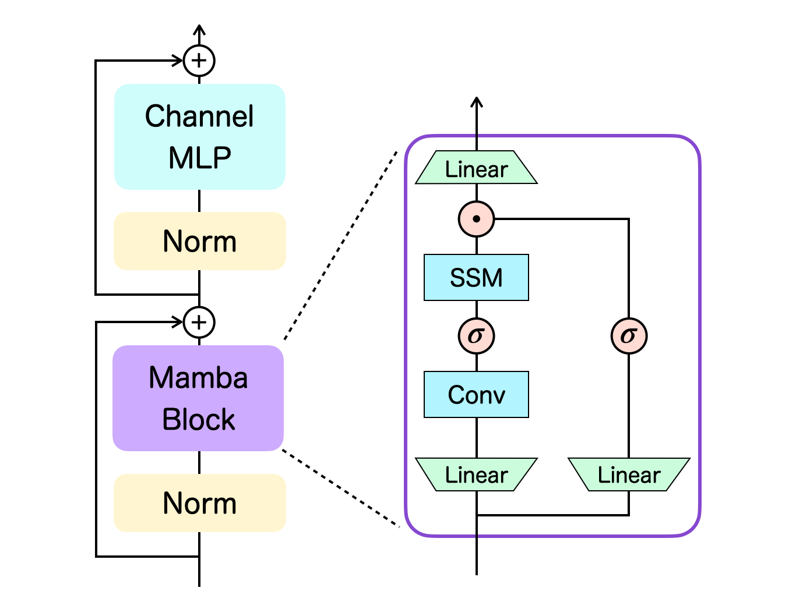

# Decision Mamba

<!--! Update this README right after the submission of the paper to arXiv -->

Reinforcement Learning via Sequence Modeling with Selective State Spaces 
https://arxiv.org/abs/2404.xxxxx

## Architecture

Below is the overview of our main module, the Mamba layer:

We adopt the basic transformer-type neural network for the Mamba layer, namely it consists of the token-mixing block and the channel-mixing block. The right-hand side of the figure illustrates the series of operations performed inside the Mamba block. $\sigma$ the $\operatorname{SiLU}$ activation function and $\odot$ is the element-wise product. For more details, see Section 3 of the [paper](https://arxiv.org/abs/2404.xxxxx).

## Instructions

We provide the corresponding code in two sub-directories: `atari` containing code for Atari experiments and `gym` containing code for OpenAI Gym experiments. See corresponding READMEs in each folder for instructions; scripts should be run from the respective directories.

## Acknowledgements

Our code largely relies on the implementations of [decision-transformer](https://github.com/kzl/decision-transformer) and [mamba](https://github.com/state-spaces/mamba). We greatly appreciate their excellent works.

## Citation

If you use our code or find it useful, please cite the accompanying paper:
