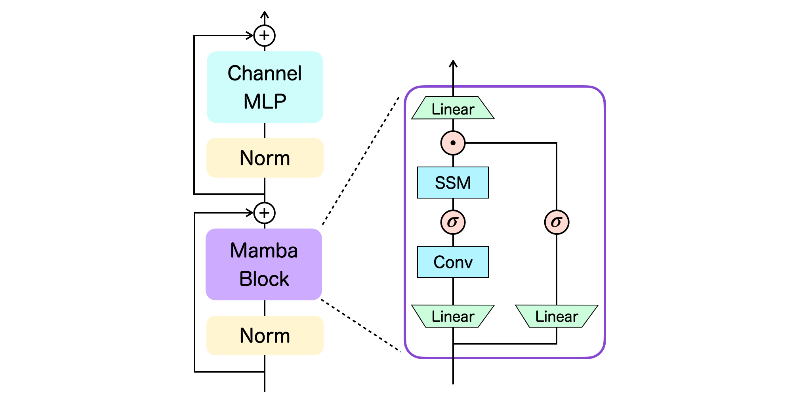

# Decision Mamba

Reinforcement Learning via Sequence Modeling with Selective State Spaces<br>
https://arxiv.org/abs/2403.19925

## Architecture

Below is the overview of our main module, the Mamba layer:


We adopt the basic Transformer-type neural network architecture for the Mamba layer, namely it consists of the token-mixing block and the channel-mixing block. The right-hand side of the figure illustrates the series of operations performed inside the Mamba block. $\sigma$ is the $\mathrm{SiLU}$ activation function and $\odot$ denotes the element-wise product. For more details, see Section 3 of the [paper](https://arxiv.org/abs/2403.19925).

## Instructions

We provide the corresponding code in two sub-directories: `atari` containing code for Atari experiments and `gym` containing code for OpenAI Gym experiments. See corresponding READMEs in each folder for instructions. Scripts should be run from the respective directories.

## Acknowledgements

Our code largely relies on the implementations of [decision-transformer](https://github.com/kzl/decision-transformer) and [mamba](https://github.com/state-spaces/mamba). We thank their excellent works.

## Citation

If you use our code, or otherwise found our work useful, please cite the accompanying paper:

```bibtex
@article{ota2024decision,
    title   = {Decision Mamba: Reinforcement Learning via Sequence Modeling with Selective State Spaces},
    author  = {Toshihiro Ota},
    journal = {arXiv preprint arXiv:2403.19925},
    year    = {2024}
}
```